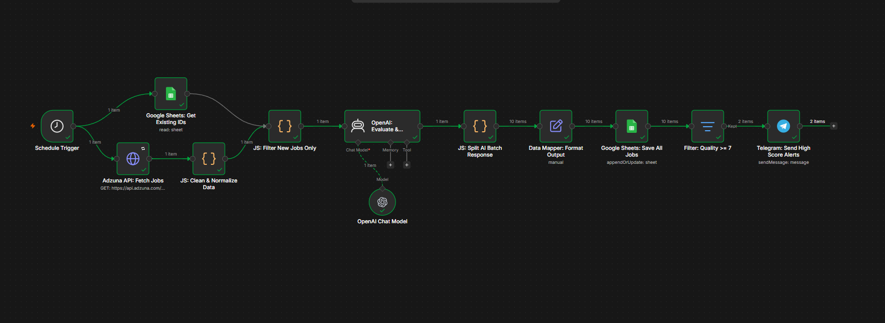
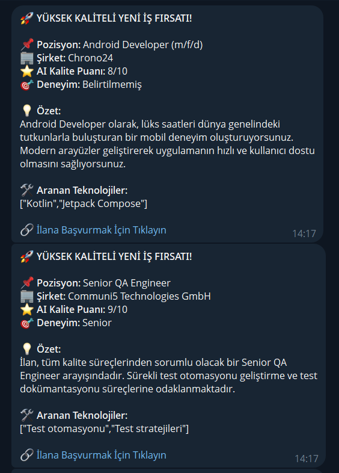
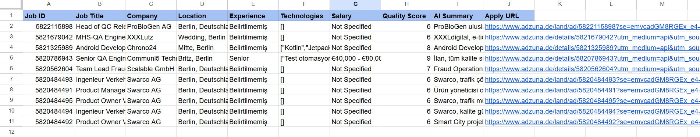

# 🤖 SmartJob Radar
> An AI-powered job monitoring workflow built with **n8n**, **OpenAI**, **Google Sheets**, and **Telegram**.

Automatically fetches software job listings, removes duplicates, analyzes each opportunity using AI, stores structured results in Google Sheets, and sends high-quality job alerts directly to Telegram.

---

## 📸 Workflow Overview

> ⚠️ Replace these with your own screenshots before publishing — placeholder/broken images make a README look unfinished.

### n8n Workflow


### Telegram Notification


### Google Sheets Output


---

# ✨ Features

- 🔍 Automatically fetches software job listings from the Adzuna API
- 🧹 Prevents duplicate job entries by checking existing IDs already stored in Google Sheets before processing
- 🤖 Uses OpenAI to analyze and score each job posting
- 📊 Stores structured job data in Google Sheets
- 📲 Sends formatted Telegram notifications for high-quality opportunities (quality score ≥ 7)
- ⏰ Runs automatically on a schedule
- ⚡ Fully automated end-to-end workflow

---

# 🏗 Workflow Architecture

```text
Schedule Trigger
        │
        ▼
Fetch Jobs (Adzuna API)
        │
        ▼
Duplicate Detection (Google Sheets ID lookup)
        │
        ▼
OpenAI Analysis
        │
        ▼
Format Structured Output
        │
        ├────────────► Google Sheets
        │
        ▼
Quality Filter (score ≥ 7)
        │
        ▼
Telegram Notification
```

---

# 🛠 Tech Stack

| Technology | Purpose |
|------------|---------|
| n8n | Workflow Automation |
| OpenAI | AI Job Analysis |
| Adzuna API | Job Data Source |
| Google Sheets API | Data Storage |
| Telegram Bot API | Notifications |
| JavaScript | Data Processing |

---

# 🚀 Installation

1. Clone this repository.
```bash
git clone https://github.com/BerkAydemir8n/SmartJob-Radar.git
```

2. Import `workflow.json` into n8n.

3. Create the required credentials in n8n:
- OpenAI
- Google Sheets OAuth2
- Telegram Bot
- Adzuna API

4. Replace the placeholder values in the workflow with your own:

| Placeholder | Where to get it |
|---|---|
| `YOUR_ADZUNA_APP_ID` / `YOUR_ADZUNA_APP_KEY` | Register a free account at [developer.adzuna.com](https://developer.adzuna.com/) |
| `YOUR_GOOGLE_SHEET_ID` | The ID in your Google Sheet's URL (`.../d/<SHEET_ID>/edit`) |
| `YOUR_TELEGRAM_CHAT_ID` | Message [@userinfobot](https://t.me/userinfobot) on Telegram to get your chat ID |

5. Activate the workflow.

---

# 📂 Project Structure

```
SmartJob-Radar
│
├── workflow.json
├── README.md
├── LICENSE
└── screenshots
    ├── workflow.png
    ├── telegram-alert.png
    └── google-sheets.png
```

---

# 💡 Use Cases

- Personal job monitoring
- Recruitment agencies
- Career coaches
- Software developers
- Remote job tracking
- AI-powered job alerts

---

# 🔮 Future Improvements

- Resume matching with AI
- Skill gap analysis
- Weekly PDF reports
- Multi-country job search
- Email notifications
- Discord integration
- Slack integration
- Web dashboard

---

# 👨‍💻 Author

**Berk Aydemir**
AI Automation Engineer
GitHub: https://github.com/BerkAydemir8n

---

# 📄 License

This project is licensed under the MIT License.
